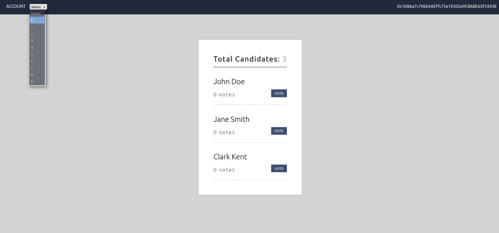
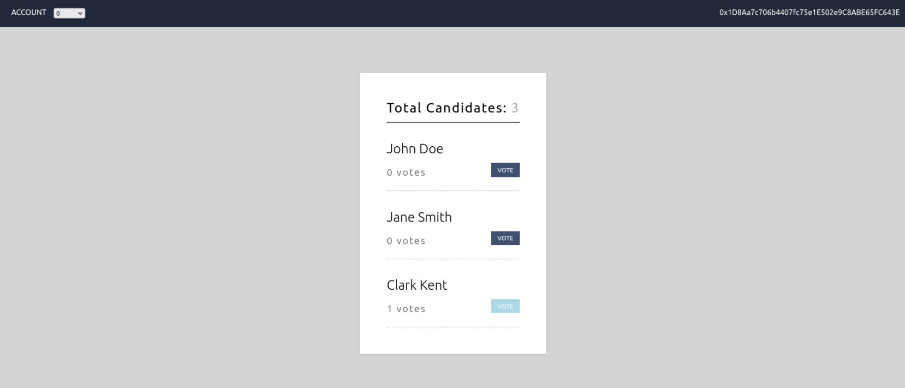
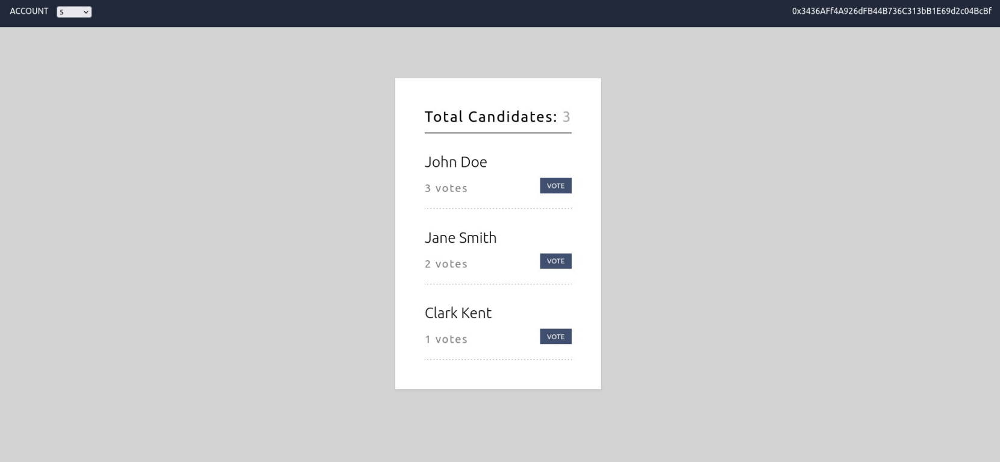
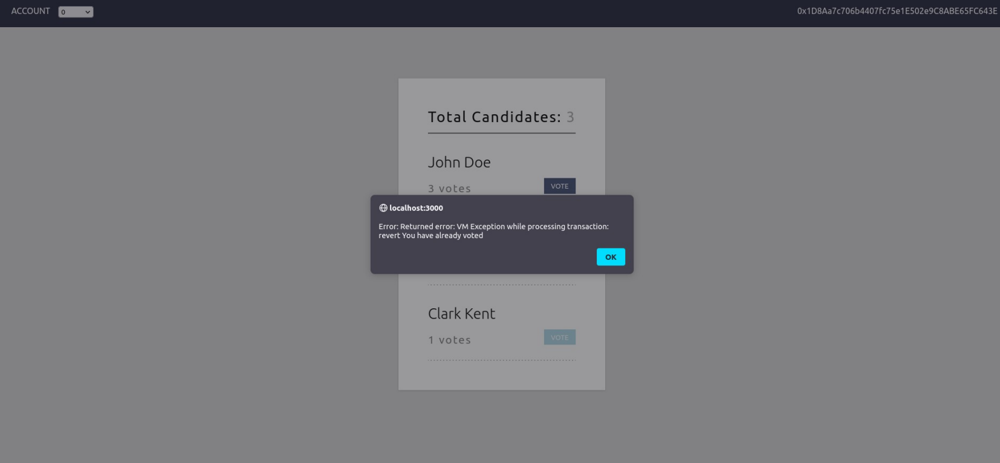

# Web3 Front-End DApp

This project was bootstrapped with [Create React App](https://github.com/facebook/create-react-app). It relies on a local [Ganache](https://trufflesuite.com/ganache/)
blockchain to demonstrate basic [Web3](https://web3js.readthedocs.io/en/v1.7.4/) library calls to a smart contract.

### Demo Run

Selecting account to view perspective from

Voting for Clark Kent as Account 0 (0x1D8Aa7c706b4407fc75e1E502e9C8ABE65FC643E)

More voting takes place

Account 0 tries to vote again (Gets error due to already having voted)

